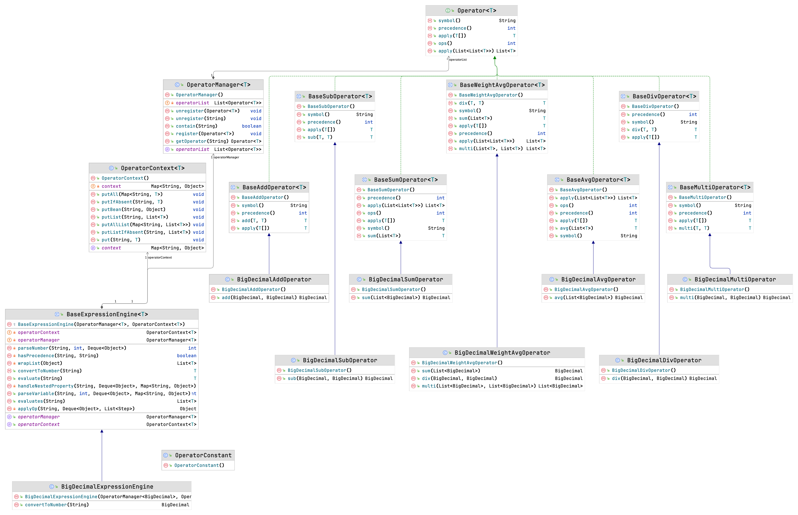

# pps-cece

基于字符串表达式的轻量级计算引擎 CharSequence Expression Calculate Engine(简称cece)

## 特性

- 将字符串表达式解析成算术表达式并计算结果（如 `a` * `data.b` - 100，最终解析成参数`a`的值乘以参数`data`对应属性`b`的值再减100，其中`a`和`data.b`可为单一数值，亦可为列表，若为列表需等长）
- 轻量级，代码简洁便于阅读
- 扩张性良好，支持**自定义操作器（默认提供加、减、乘、除、算术均值、合计、加权均值）**、支持**不同数值类（如 Double、BigDecimal等，可自行扩展）**
- 支持**SPI机制**扩展**自定义操作器**
- 内嵌**逻辑运算**、**条件运算**
- 支持自适应列表计算，情况包含（标量`ops`标量、标量`op`列表、列表`op`标量、列表`op`列表【等长】）
- 支持`bean`的`nestedProperty`作为计算参数，即`data.ep.ele`最终解析为参数`data`对象的`ep`属性对象的`ele`属性的值
- 支持计算上下文参数

## 类图

## 扩展

- 数值类型扩展
  参考[BigDecimal类型加法操作器](src/main/java/com/tsintergy/pps/cece/operator/bd/BigDecimalAddOperator.java)、[BigCecimal类型计算引擎](src/main/java/com/tsintergy/pps/cece/engine/bd/BigDecimalExpressionEngine.java)
- 操作器扩展
  参考[加法操作器](src/main/java/com/tsintergy/pps/cece/operator/BaseAddOperator.java)、[合计操作器](src/main/java/com/tsintergy/pps/cece/operator/BaseSumOperator.java)

## 示例

示例参考：[BigDecimal计算引擎单元测试](src/test/java/com/tsintergy/pps/cece/engine/bd/BigDecimalExpressionEngineTest.java)